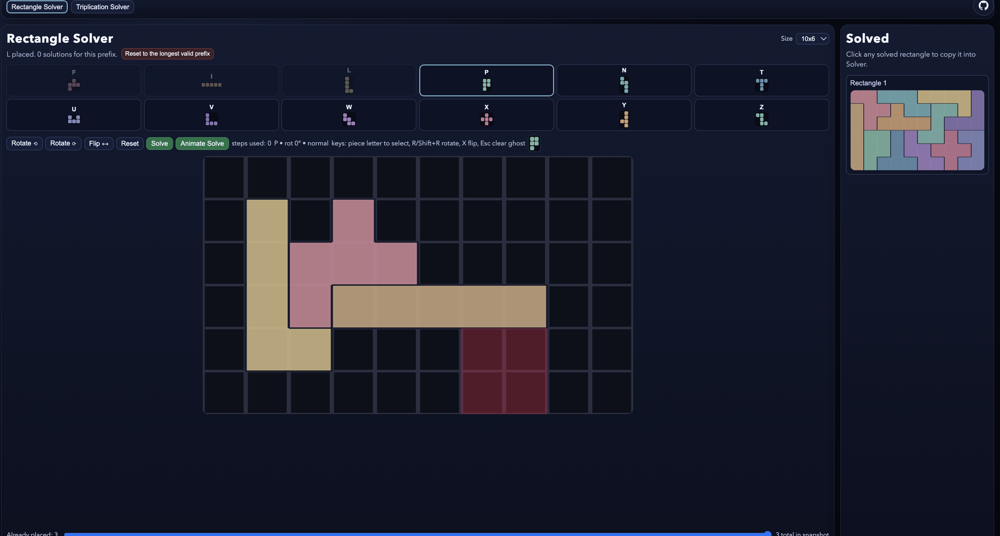

# Pentomanim

## A successful experiment

This is an experiment in using the codex workflow.
Most of you don't care and just want to play with the svelte app
[pentomanim](https://pentomanim.vercel.app/) hosted on vercel.

<p align="center">
  
</p>

[What it does](#2-webgl-app).

I did not do any publicity except a
[post](https://discord.com/channels/457912077277855764/1472360313167806595)
on discord.

The goal is to generate and maintain a svelte interactive pentamino solver app
with click or touch interface, meaning working in desktops, smartphone and tablets. I ended up designing the interface on manim. And I am now experimenting
on generating a  manim video about DFS using pentomino solving as
an example. Nothing much to see now except
[that](manim/triplication_dfs_tree.mp4).

<p align="center">
  
</p>

[Personal](/PERSONAL.md) contains some trivia about my personal history
with pentominoes.

## Details and install

This repository contains two pentomino apps:

1. `manim/`: Python + Manim animation scripts.
2. `webgl/`: interactive Svelte + TypeScript + WebGL pentomino solver UI.

## 1) Manim App

Location: `/Users/cog/mine/pentomanim/manim`

### Files

- `pentomino_6x10.py`
- `pentomino_6x10_five.py`
- `triplication_dfs_tree.py`
- `rect_6x10_dfs_tree.py`

### What it does

- Defines pentomino shapes and a DFS tiling solver.
- Renders animation scenes showing pentomino placements on a `6x10` rectangle.
- `pentomino_6x10_five.py` builds five unique solved rectangles and lays them out.

### Run

From repo root:

```bash
manim -pqh manim/pentomino_6x10_five.py PentominoFiveRectangles
```

Optional quality presets:

```bash
manim -pql manim/pentomino_6x10_five.py PentominoFiveRectangles  # low
manim -pqh manim/pentomino_6x10_five.py PentominoFiveRectangles  # high
```

Output videos are written under:

- `/Users/cog/mine/pentomanim/manim/media/videos/...`

### Keep `.md` and `.mp4` in sync with `.py`

Each Manim scene script `X.py` has eponymous artifacts `X.md` and `X.mp4`.
Use the sync script to update stale or missing artifacts (including new files):

```bash
python3 /Users/cog/mine/pentomanim/manim/sync_eponymous.py
```

Useful options:

```bash
python3 /Users/cog/mine/pentomanim/manim/sync_eponymous.py --dry-run
python3 /Users/cog/mine/pentomanim/manim/sync_eponymous.py --skip-render
python3 /Users/cog/mine/pentomanim/manim/sync_eponymous.py --file triplication_dfs_tree.py
```

Detailed behavior spec:

- `/Users/cog/mine/pentomanim/manim/EPONYMOUS_SYNC_SPEC.md`

## 2) WebGL App

Location: `/Users/cog/mine/pentomanim/webgl`

### What it does

- WebGL pentomino board with two tabs:
  - `Rectangle Solver`
  - `Triplication Solver`
- Rectangle sizes: `20x3`, `15x4`, `12x5`, `10x6`.
- Piece picker, rotate/flip/reset controls, ghost preview, place/remove.
- Solve and Animate Solve from current prefix, with step counter and speed slider.
- Scrollable solved-history pane; solved states can be loaded back into the solver.
- Triplication problems with a generated masked board, 9 selected pieces, and its own solved-history pane.
- Search pruning: connected empty regions must have a square count divisible by `5`.

### Install

```bash
cd /Users/cog/mine/pentomanim/webgl
bun install
```

### Run dev server

```bash
bun run dev
```

### Build

```bash
bun run build
```

### Preview build

```bash
bun run preview
```

### Deploy (Vercel)

- Framework preset: `Vite`.
- Root directory: `webgl`.
- Build command: `bun run build`.
- Output directory: `dist`.

## Notes

- The WebGL app is the interactive rewrite of the Manim logic, with additional UI features.
- Solver behavior and orientation logic are implemented in:
  - `/Users/cog/mine/pentomanim/webgl/src/lib/pentomino.ts`
  - `/Users/cog/mine/pentomanim/webgl/src/lib/solver.ts`
  - `/Users/cog/mine/pentomanim/webgl/src/lib/triplication.ts`

## Spec Commands

- `incspec` means: incremental spec.
- In practice, this means reformulating the current spec, or a specific part
  of it, by applying incremental changes.
- The spec directive means to restate the current spec or current sub-spec
  (part of the spec), then apply the requested incremental changes.
- An `incspec` response must include a section named
  `Imprecisions / Inconsistencies`.
- That section must explicitly list unclear, conflicting, or underspecified
  points that still require decisions.
